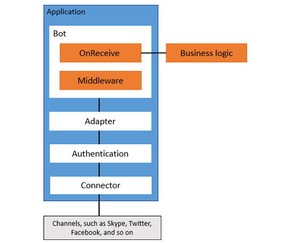

# Overview
Bot Builder SDK v4 is a modular and extensible framework for developing bots. It provides libraries, samples, and tools to help you build and debug bots. With Bot Builder SDK v4, you can create bots in C#, JavaScript, Java, and Python.  
A bot is an application than can communicate conversationally with a user. A bot may be as simple as a basic pattern matching algorithm that returns a response, or it may include artificial intelligence, complex conversational state, and integration with existing business services.
## Architecture
The SDK defines a bot object that can communicate with a user over various channels. The bot itself does not need to manage connections to these channels, as that is handled through an adapter. The bot object also defines a middleware collection and a way to call out to your business logic. The following diagram illustrates elements of a bot application, and the following sections describe these in more detail.

## The bot object and adapter
The bot constructor requires an adapter, which handles authentication and manages HTTP requests from the connector layer.
The bot object exposes an incoming request as an activity. You can connect your bot to your business logic from the bot’s receive activity handler. The bot can optionally send activities back to the caller. The adapter sends this information to the callback URL provided in the original request.

Note: The bot handles requests asynchronously, and the business logic does not need to be request-response driven.
## Middleware
Use middleware to add reusable, application-independent components to your application in a modular way.
- The bot processes activities through its middleware layers.
- Middleware can establish and persist context and react to incoming requests.
- You add middleware to the bot object at initialization time.
- The order in which you add middleware to the bot determines the order in which the bot calls the middleware.
- The library provides some predefined middleware, but you can define your own.
## Pipelines
The bot object invokes middleware via the following pipelines:
1. Create context – establishes and enriches a context object that represents the request and conversation state. 
1. Receive activity – operates on the request.
1. Post activity – persists context and updates conversation state.

Each middleware component in a pipeline is responsible for invoking the next component in the pipeline, or short-circuiting the chain if appropriate. The bot’s receive activity handler acts as the last handler on the receive activity pipeline.
